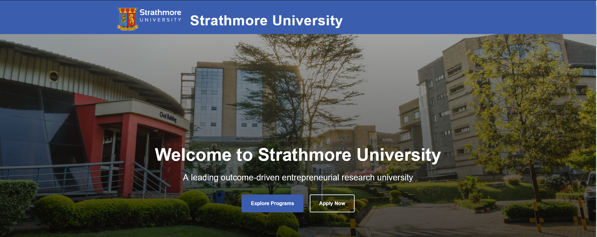

# Strathmore University Webpage

A modern, responsive website for Strathmore University created as part of a Multimedia Applications assignment. The site showcases the university's profile, academic programs, achievements, and ongoing initiatives.



## Live Demo
[View Live Demo](https://NMsby.github.io/strathmore-university-webpage/)

## Table of Contents
- [Overview](#overview)
- [Features](#features)
- [Technologies Used](#technologies-used)
- [Getting Started](#getting-started)
- [Project Structure](#project-structure)
- [Responsive Design](#responsive-design)
- [Accessibility](#accessibility)
- [Credits](#credits)
- [License](#license)

## Overview

This project is a responsive, user-friendly website for Strathmore University that highlights the institution's mission, vision, academic offerings, achievements, and contact information. Built with HTML5, CSS3, and JavaScript, the website follows modern web development practices and features an accessible, responsive design.

## Features

- **Responsive Design**: Fully responsive layout that adapts to all device sizes
- **Dark/Light Theme Toggle**: User preference-based theme switching with local storage persistence
- **Interactive Elements**:
    - Animated counters for university statistics
    - Hover effects for cards and buttons
    - Smooth scrolling navigation
    - Back-to-top button for easy navigation
- **Multimedia Elements**:
    - Orbit animation in the mission/vision section
    - School subject icons with interactive effects
    - Project card animations
- **Accessibility Features**:
    - Semantic HTML structure
    - ARIA attributes
    - Keyboard navigation support
    - Screen reader compatibility
    - High contrast mode support
    - Reduced motion option
- **Print-Friendly Styling**: Optimized layout when printing the webpage

## Technologies Used

- HTML5
- CSS3 (Custom properties, Flexbox, Grid, Animations)
- JavaScript (ES6+)
- FontAwesome for icons
- Responsive design techniques
- Accessibility best practices

## Getting Started

### Prerequisites
- Any modern web browser (Chrome, Firefox, Safari, Edge)

### Installation
1. Clone the repository:
```bash
  git clone https://github.com/NMsby/strathmore-university-webpage.git
```

2. Navigate to the project directory:
```bash
  cd strathmore-university-webpage
```

3. Open `index.html` in your browser to view the website.

## Project Structure

```
strathmore-university-webpage/
│
├── index.html              # Main HTML file
├── assets/
│   ├── css/
│   │   └── styles.css      # Main stylesheet
│   ├── images/
│   │   ├── strathmore-logo.png
│   │   ├── campus-hero.jpg
│   │   └── favicon.ico
│   └── js/                 # JavaScript (included inline in index.html)
│
└── README.md               # Project documentation
```

## Responsive Design

The website implements a mobile-first approach with responsive design principles:

- Fluid layouts using Flexbox and Grid
- Relative units (rem, em, %)
- Media queries for different device sizes:
    - Mobile (< 576px)
    - Tablet (≥ 768px)
    - Desktop (≥ 992px)
    - Large desktop (≥ 1200px)

## Accessibility

Accessibility features include:

- Semantic HTML elements
- ARIA attributes for interactive elements
- Keyboard navigation support
- Screen reader considerations
- Sufficient color contrast
- Focus indicators
- Skip-to-content link
- Support for reduced motion
- High contrast mode support

## Credits

- Images: Strathmore University
- Icons: FontAwesome
- Fonts: System fonts (Arial, Helvetica, sans-serif)

## License

This project is licensed under the MIT License — see the [LICENSE](LICENSE) file for details. It is created for educational purposes as part of a Multimedia Applications assignment.